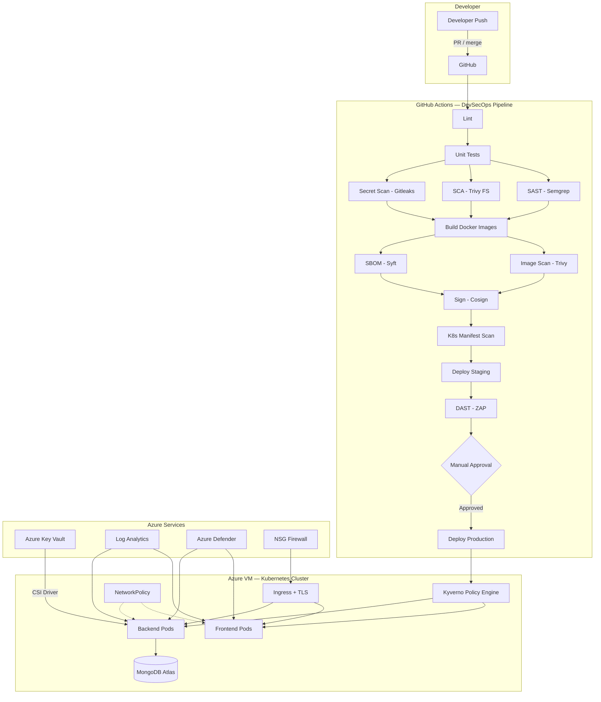

# DevSecOps Transformation Plan — Unified Inbox

> Generated for: Unified Inbox (React + Node.js + MongoDB Atlas)
> Deployed on: Azure VM with Kubernetes (kubectl pods)
> Date: April 2026

---

## Section A: Current-State Assessment

### Maturity Level: **1 out of 5 (Initial / Ad-hoc)**

| Area                | Current State                                                                          | Risk     |
| ------------------- | -------------------------------------------------------------------------------------- | -------- |
| CI/CD               | GitHub Actions builds & pushes Docker images on `main` push — no tests, no gates       | HIGH     |
| Security scanning   | None (no SAST, SCA, secret scan, container scan)                                       | CRITICAL |
| Secrets management  | Hardcoded in `backend-secrets.yaml` AND `docker-compose.yml`, committed to Git history | CRITICAL |
| Container hardening | Running as root, no health checks, no multi-stage on backend                           | HIGH     |
| Kubernetes security | No probes, no NetworkPolicy, no PDB, no securityContext, NodePort exposed directly     | HIGH     |
| Testing             | Zero tests (`"test": "echo \"No test specified\""`)                                    | HIGH     |
| Monitoring          | None                                                                                   | MEDIUM   |
| Image tagging       | `:latest` only — no immutable tags                                                     | MEDIUM   |
| TLS/HTTPS           | Not configured                                                                         | HIGH     |
| RBAC                | App-level role checking exists in middleware; K8s RBAC not configured                  | MEDIUM   |

### Leaked Secrets (MUST rotate immediately)

- MongoDB Atlas URI + password
- JWT secret
- WhatsApp access token + verify token
- Facebook App Secret + Page Access Token
- Instagram Access Token
- Gmail app password

---

## Section B: Target Architecture



### Branching Strategy

| Branch      | Purpose               | Deploys to                          |
| ----------- | --------------------- | ----------------------------------- |
| `main`      | Production-ready code | Staging → (approval) → Production   |
| `develop`   | Integration branch    | Dev namespace                       |
| `feature/*` | Feature work          | PR checks only (lint + test + scan) |
| `hotfix/*`  | Production fixes      | Fast-track to main                  |

### Environment Strategy

| Environment | K8s Namespace | Trigger                   | Approval                    |
| ----------- | ------------- | ------------------------- | --------------------------- |
| Dev         | `dev`         | Push to `develop`         | None                        |
| Staging     | `staging`     | Push to `main`            | Auto                        |
| Production  | `production`  | After staging DAST passes | Manual (GitHub Environment) |

---

## Section C: DevSecOps Pipeline Design

### Tool Selection (beginner-friendly, open-source, free)

| Stage             | Tool                            | Why                                               |
| ----------------- | ------------------------------- | ------------------------------------------------- |
| Lint              | ESLint                          | Already in Node ecosystem, zero cost              |
| Test              | Jest + React Testing Library    | Default for CRA, easy setup                       |
| SAST              | **Semgrep**                     | Free, fast, great JS/Node rules, SARIF output     |
| SCA               | **Trivy (fs mode)** + npm audit | Single binary, scans both lock files and code     |
| Secret Scan       | **Gitleaks**                    | Fast, good default rules, GitHub Action available |
| Container Scan    | **Trivy (image mode)**          | Same tool as SCA — one tool to learn              |
| SBOM              | **Syft** (Anchore)              | Free, SPDX + CycloneDX output                     |
| Image Signing     | **Cosign** (Sigstore)           | Keyless signing, industry standard                |
| K8s Policy        | **Kyverno**                     | YAML-native (no Rego to learn like OPA)           |
| K8s Manifest Scan | **Kubesec** + Trivy config      | Catches misconfigs before deploy                  |
| DAST              | **OWASP ZAP**                   | Free, GitHub Action, baseline scan                |
| GitOps (optional) | **Argo CD**                     | Most popular, good UI, free                       |

### Pipeline Flow (13 stages)

See `.github/workflows/devsecops.yml` — created in this project.

**Policy gates that BLOCK the build:**

1. Semgrep SAST findings → uploaded to GitHub Security tab
2. Trivy HIGH/CRITICAL in images → `exit-code: 1` fails the job
3. Gitleaks secret found → blocks merge
4. Kyverno Enforce policies → rejects non-compliant pods at admission

---

## Section D: Azure Hardening Checklist

### D1. NSG (Network Security Group) Rules

```bash
# On your Azure VM, allow ONLY these inbound:
# 1. SSH from YOUR IP only
az network nsg rule create -g <RG> --nsg-name <NSG> -n AllowSSH \
  --priority 100 --access Allow --protocol Tcp --destination-port-ranges 22 \
  --source-address-prefixes <YOUR_IP>/32

# 2. HTTPS (443) from anywhere (for Ingress)
az network nsg rule create -g <RG> --nsg-name <NSG> -n AllowHTTPS \
  --priority 200 --access Allow --protocol Tcp --destination-port-ranges 443 \
  --source-address-prefixes '*'

# 3. HTTP (80) for cert-manager ACME challenge only
az network nsg rule create -g <RG> --nsg-name <NSG> -n AllowHTTP \
  --priority 300 --access Allow --protocol Tcp --destination-port-ranges 80 \
  --source-address-prefixes '*'

# 4. DENY everything else inbound (default)
az network nsg rule create -g <RG> --nsg-name <NSG> -n DenyAllInbound \
  --priority 4096 --access Deny --protocol '*' --destination-port-ranges '*' \
  --source-address-prefixes '*'

# REMOVE any NodePort rules (30000-32767) you may have added!
```

### D2. Azure Key Vault Integration

```bash
# 1. Create Key Vault
az keyvault create -n unified-inbox-kv -g <RG> --location <LOCATION>

# 2. Store each secret
az keyvault secret set --vault-name unified-inbox-kv --name MONGO-URI --value "<your-new-rotated-uri>"
az keyvault secret set --vault-name unified-inbox-kv --name JWT-SECRET --value "$(openssl rand -base64 48)"
# ... repeat for each secret

# 3. Install CSI Secret Store driver on your K8s cluster
helm repo add csi-secrets-store-provider-azure https://azure.github.io/secrets-store-csi-driver-provider-azure/charts
helm install csi csi-secrets-store-provider-azure/csi-secrets-store-provider-azure -n kube-system

# 4. Create a SecretProviderClass (see k8s/secret-provider-class.yaml)
```

### D3. Log Analytics + Container Insights

```bash
# 1. Create Log Analytics workspace
az monitor log-analytics workspace create -g <RG> -n unified-inbox-logs

# 2. Get workspace ID
WORKSPACE_ID=$(az monitor log-analytics workspace show -g <RG> -n unified-inbox-logs --query id -o tsv)

# 3. Install Azure Monitor agent on VM
az vm extension set --resource-group <RG> --vm-name <VM> \
  --name AzureMonitorLinuxAgent --publisher Microsoft.Azure.Monitor

# 4. For K8s: install Prometheus + Grafana (free)
helm repo add prometheus-community https://prometheus-community.github.io/helm-charts
helm install monitoring prometheus-community/kube-prometheus-stack -n monitoring --create-namespace
```

### D4. Azure Defender

```bash
# Enable Defender for Servers (free tier available)
az security pricing create -n VirtualMachines --tier free

# Enable Defender for Containers (if you later move to ACR)
az security pricing create -n Containers --tier standard
```

### D5. Backup & Disaster Recovery

| What              | Strategy                                      | Tool                                 |
| ----------------- | --------------------------------------------- | ------------------------------------ |
| MongoDB Atlas     | Built-in continuous backup (Atlas handles it) | Atlas UI                             |
| K8s manifests     | Stored in Git (GitOps = backup)               | Git                                  |
| K8s cluster state | Velero backup to Azure Blob                   | `velero install --provider azure`    |
| VM snapshot       | Azure VM backup                               | `az backup protection enable-for-vm` |

---

## Section E: File-by-File Changes Summary

| File                              | Action       | What Changed                                                                |
| --------------------------------- | ------------ | --------------------------------------------------------------------------- |
| `.github/workflows/devsecops.yml` | **CREATED**  | Full 13-stage DevSecOps pipeline                                            |
| `.github/workflows/ci-cd.yml`     | **REPLACE**  | Old pipeline — superseded by devsecops.yml (delete it)                      |
| `.gitleaks.toml`                  | **CREATED**  | Gitleaks config with custom MongoDB + Facebook token rules                  |
| `k8s/backend-deployment.yaml`     | **MODIFIED** | Added securityContext, probes, non-root, labels, strategy, ClusterIP        |
| `k8s/frontend-deployment.yaml`    | **MODIFIED** | Added securityContext, probes, non-root, labels, strategy, ClusterIP        |
| `k8s/backend-secrets.yaml`        | **MODIFIED** | Removed ALL hardcoded secrets → template with REPLACE_ME                    |
| `k8s/network-policy.yaml`         | **CREATED**  | Default deny + frontend/backend isolation rules                             |
| `k8s/pdb.yaml`                    | **CREATED**  | PodDisruptionBudgets for both services                                      |
| `k8s/ingress-tls.yaml`            | **CREATED**  | Ingress with TLS, security headers, rate limiting, WebSocket                |
| `k8s/kyverno-policies.yaml`       | **CREATED**  | 5 policies: no-root, no-priv-esc, require-limits, require-probes, no-latest |
| `server/Dockerfile`               | **MODIFIED** | Multi-stage, non-root user, npm ci, healthcheck                             |
| `client/Dockerfile`               | **MODIFIED** | Non-root nginx user, npm ci, healthcheck                                    |
| `docker-compose.yml`              | **MODIFIED** | Removed hardcoded MONGO_URI and JWT_SECRET                                  |
| `.gitignore`                      | **MODIFIED** | Added patterns for secrets and scan artifacts                               |

---

## Section F: Phase Plan with Timeline

### Phase 0: Emergency Security Fixes (Day 1 — 2-4 hours)

**Risk level: CRITICAL**

| #   | Task                               | Command / Action                                                          |
| --- | ---------------------------------- | ------------------------------------------------------------------------- |
| 1   | Rotate MongoDB Atlas password      | Atlas UI → Database Access → Edit user → new password                     |
| 2   | Rotate JWT secret                  | `openssl rand -base64 48` → update .env and K8s secret                    |
| 3   | Regenerate Facebook App Secret     | Facebook Developer Portal → App Settings → Reset                          |
| 4   | Generate new WhatsApp access token | Meta Business Suite → System Users → Generate token                       |
| 5   | Generate new Instagram token       | Same Meta Business Suite flow                                             |
| 6   | Generate new Gmail App Password    | Google Account → Security → App Passwords → Delete old, create new        |
| 7   | Remove secrets from Git history    | `git filter-repo --path k8s/backend-secrets.yaml --invert-paths`          |
| 8   | Force-push cleaned history         | `git push --force --all` (coordinate with team)                           |
| 9   | Update K8s secrets on Azure VM     | `kubectl delete secret backend-secrets && kubectl apply -f <new-secrets>` |
| 10  | Verify app still works             | Test all channels: WhatsApp, Facebook, Instagram, Email                   |

**Success criteria:** All old tokens invalidated, app runs with new secrets, Git history clean.
**Rollback:** Keep a local backup of old `.env` until new secrets are confirmed working.

---

### Phase 1: CI Hardening (Days 2-5 — 1 week)

**Risk level: MEDIUM**

| #   | Task                     | Detail                                                                     |
| --- | ------------------------ | -------------------------------------------------------------------------- |
| 1   | Delete old `ci-cd.yml`   | Replace with `devsecops.yml`                                               |
| 2   | Add ESLint config        | `npm init @eslint/config` in root and client                               |
| 3   | Add basic tests          | At minimum: 1 backend health check test, 1 frontend render test            |
| 4   | Enable Semgrep           | Already in pipeline — push and verify SARIF appears in GitHub Security tab |
| 5   | Enable Gitleaks          | Already in pipeline — verify it catches test secrets                       |
| 6   | Enable Trivy FS scan     | Already in pipeline — review first results                                 |
| 7   | Add GitHub secrets       | `DOCKER_USERNAME`, `DOCKER_PASSWORD`, `KUBE_CONFIG`, `AZURE_VM_IP`         |
| 8   | Test pipeline end-to-end | Create a PR to `main`, verify all stages run                               |

**Success criteria:** PR cannot merge if Gitleaks or Trivy finds critical issues.
**Rollback:** Revert to `ci-cd.yml` if pipeline blocks work.

---

### Phase 2: Secure CD (Days 6-14 — 1.5 weeks)

**Risk level: MEDIUM-HIGH**

| #   | Task                         | Detail                                                                                    |
| --- | ---------------------------- | ----------------------------------------------------------------------------------------- |
| 1   | Create K8s namespaces        | `kubectl create ns staging && kubectl create ns production`                               |
| 2   | Deploy Kyverno               | `kubectl apply -f kyverno-install.yaml`                                                   |
| 3   | Apply Kyverno policies       | `kubectl apply -f k8s/kyverno-policies.yaml`                                              |
| 4   | Apply NetworkPolicies        | `kubectl apply -f k8s/network-policy.yaml`                                                |
| 5   | Install nginx-ingress        | `helm install ingress-nginx ingress-nginx/ingress-nginx`                                  |
| 6   | Install cert-manager         | `helm install cert-manager jetstack/cert-manager --set installCRDs=true`                  |
| 7   | Apply Ingress manifest       | `kubectl apply -f k8s/ingress-tls.yaml -n production`                                     |
| 8   | Set up GitHub Environments   | Settings → Environments → create "staging" and "production" (add approval for production) |
| 9   | Configure KUBE_CONFIG secret | Export kubeconfig from VM, base64 encode, add to GitHub secrets                           |
| 10  | Enable Cosign signing        | Pipeline already configured — verify signatures with `cosign verify`                      |
| 11  | Deploy SBOM generation       | Already in pipeline — archive SBOMs as artifacts                                          |
| 12  | DAST with ZAP                | Pipeline scans staging after deploy — review results                                      |

**Success criteria:** Staging deploys automatically, production requires approval, Kyverno blocks non-compliant pods.
**Rollback:** `kubectl rollout undo deployment/<name> -n production`

---

### Phase 3: Observability & Compliance (Days 15-30 — 2 weeks)

**Risk level: LOW**

| #   | Task                         | Detail                                                  |
| --- | ---------------------------- | ------------------------------------------------------- |
| 1   | Install Prometheus + Grafana | Helm chart (see Section D3)                             |
| 2   | Configure alerts             | High CPU, pod restarts, 5xx error rate                  |
| 3   | Velero for K8s backup        | `velero install --provider azure`                       |
| 4   | Azure Key Vault CSI driver   | Replace K8s Secrets with Key Vault references           |
| 5   | NSG lockdown                 | Apply rules from Section D1                             |
| 6   | Enable Azure Defender        | Free tier for VMs                                       |
| 7   | Centralized logging          | EFK stack or Azure Log Analytics                        |
| 8   | Compliance dashboard         | Kyverno Policy Reporter UI                              |
| 9   | Document runbooks            | Incident response, secret rotation, rollback procedures |

**Success criteria:** Dashboard shows pod health, alerts fire on anomalies, all secrets from Key Vault.
**Rollback:** Each component is independent; remove individually if issues arise.

---

## Section G: Day-1 Quick Start (First 2 Hours)

**Hour 1: Emergency remediation**

```bash
# Step 1: On your LOCAL machine — pull latest
cd "C:\Users\ademx\OneDrive\Bureau\Projet PFE"
git pull

# Step 2: Rotate JWT secret (use this as your new one)
# PowerShell:
[Convert]::ToBase64String((1..48 | ForEach-Object { Get-Random -Maximum 256 }) -as [byte[]])
# Save the output — this is your new JWT_SECRET

# Step 3: Go to MongoDB Atlas Dashboard
# → Database Access → Edit your user → Change password → Save
# Copy new connection string

# Step 4: Go to Meta Business Suite
# → Regenerate all tokens (WhatsApp, Facebook, Instagram)

# Step 5: Go to Google Account → Security → App Passwords
# → Delete old app password → Create new one

# Step 6: Update your .env file with ALL new values

# Step 7: Clean Git history (install git-filter-repo first)
pip install git-filter-repo
git filter-repo --path k8s/backend-secrets.yaml --invert-paths --force
git filter-repo --path docker-compose.yml --blob-callback '
  if b"mongodb+srv://" in blob.data:
    blob.data = blob.data.replace(b"u9fKmUyITMOCEsdP", b"REDACTED")
' --force

# Step 8: Force push (THIS REWRITES HISTORY — everyone must re-clone)
git push --force --all
```

**Hour 2: Pipeline activation**

```bash
# Step 1: Delete old pipeline
Remove-Item ".github\workflows\ci-cd.yml"

# Step 2: Add GitHub Secrets (in GitHub → repo → Settings → Secrets → Actions)
# Add these secrets:
#   DOCKER_USERNAME    = ademxd
#   DOCKER_PASSWORD    = <your Docker Hub token>
#   KUBE_CONFIG        = <base64 of ~/.kube/config from your Azure VM>
#   AZURE_VM_IP        = <your VM's public IP>

# Step 3: Get KUBE_CONFIG from Azure VM
# SSH into your VM:
ssh <your-vm>
cat ~/.kube/config | base64 -w0
# Copy the output → paste as KUBE_CONFIG secret in GitHub

# Step 4: Create K8s namespaces on Azure VM
kubectl create namespace staging
kubectl create namespace production

# Step 5: Apply the new secrets with real values on the VM
# Create a local file backend-secrets-real.yaml with your new rotated values
kubectl apply -f backend-secrets-real.yaml -n staging
kubectl apply -f backend-secrets-real.yaml -n production

# Step 6: Commit and push
git add .
git commit -m "feat: DevSecOps pipeline transformation"
git push

# Step 7: Watch the pipeline in GitHub → Actions tab
```

---

## Section H: Common Mistakes and How to Avoid Them

| #   | Mistake                                        | Prevention                                                                |
| --- | ---------------------------------------------- | ------------------------------------------------------------------------- |
| 1   | **Committing secrets to Git**                  | `.gitignore` all secret files, use Gitleaks in CI, never hardcode in YAML |
| 2   | **Running containers as root**                 | Always set `runAsNonRoot: true` + `USER` in Dockerfile                    |
| 3   | **Using `:latest` tag in production**          | Pipeline uses SHA-based tags; Kyverno policy blocks `:latest` in prod     |
| 4   | **No health checks**                           | Added `livenessProbe` + `readinessProbe` to all deployments               |
| 5   | **Exposing NodePort directly**                 | Changed to ClusterIP + Ingress with TLS                                   |
| 6   | **No network segmentation**                    | NetworkPolicy: default-deny + explicit allow rules                        |
| 7   | **Skipping DAST**                              | ZAP baseline scan runs against staging before prod deploy                 |
| 8   | **No rollback plan**                           | `kubectl rollout undo` + `revisionHistoryLimit: 5`                        |
| 9   | **Ignoring scan results**                      | Pipeline has `exit-code: 1` on Trivy — blocks the build                   |
| 10  | **No manual approval for prod**                | GitHub Environment protection rules require approval                      |
| 11  | **Wide-open NSG rules**                        | Lock SSH to your IP, expose only 80/443                                   |
| 12  | **No resource limits on pods**                 | Kyverno policy enforces limits on every pod                               |
| 13  | **Force-pushing without warning team**         | Coordinate before `git push --force` — everyone must re-clone             |
| 14  | **Not testing the pipeline on a branch first** | Create a `test/devsecops` branch, verify pipeline, then merge to `main`   |

---

## Section I (Bonus): Azure VM K8s vs AKS Comparison

| Aspect              | Your Current (VM + kubectl)    | AKS (Managed)                                                             |
| ------------------- | ------------------------------ | ------------------------------------------------------------------------- |
| **Cost**            | ~$30–60/mo (B2s VM)            | Free control plane + node VM cost (~$30–60/mo for B2s node)               |
| **Maintenance**     | You patch OS, K8s, etcd, certs | Microsoft patches control plane; you patch nodes (auto-upgrade available) |
| **Scaling**         | Manual (add VMs or resize)     | Auto node pool scaling                                                    |
| **Networking**      | You configure CNI, kube-proxy  | Azure CNI managed, integrated with VNet                                   |
| **Key Vault**       | Manual CSI driver install      | Native integration                                                        |
| **Monitoring**      | Manual Prometheus install      | Container Insights built-in                                               |
| **Security**        | Manual Defender setup          | Defender for Containers auto-integrated                                   |
| **Uptime SLA**      | None (single VM = SPOF)        | 99.95% SLA (paid tier)                                                    |
| **Student budget?** | ✅ Cheapest option now         | ✅ Similar cost, less maintenance                                         |

**Recommendation:** Stay on your VM for now (budget), but plan to migrate to AKS when the project matures. The manifests you have will work on AKS with zero changes.

### Migration path (when ready):

```bash
# 1. Create AKS cluster
az aks create -g <RG> -n unified-inbox-aks --node-count 2 --node-vm-size Standard_B2s --enable-managed-identity

# 2. Get credentials
az aks get-credentials -g <RG> -n unified-inbox-aks

# 3. Apply same manifests
kubectl apply -f k8s/ -n production

# 4. Update DNS to point to new AKS Ingress IP
# 5. Verify, then decommission VM
```

---

## Cost Summary (Student Budget)

| Item                                                      | Monthly Cost      |
| --------------------------------------------------------- | ----------------- |
| Azure VM (B2s)                                            | ~$30–40           |
| Docker Hub (free tier)                                    | $0                |
| MongoDB Atlas (M0 free)                                   | $0                |
| GitHub Actions (free for public, 2000 min/mo for private) | $0                |
| Semgrep (open source)                                     | $0                |
| Trivy (open source)                                       | $0                |
| Gitleaks (open source)                                    | $0                |
| Cosign (open source)                                      | $0                |
| Kyverno (open source)                                     | $0                |
| Let's Encrypt TLS                                         | $0                |
| **Total**                                                 | **~$30–40/month** |
