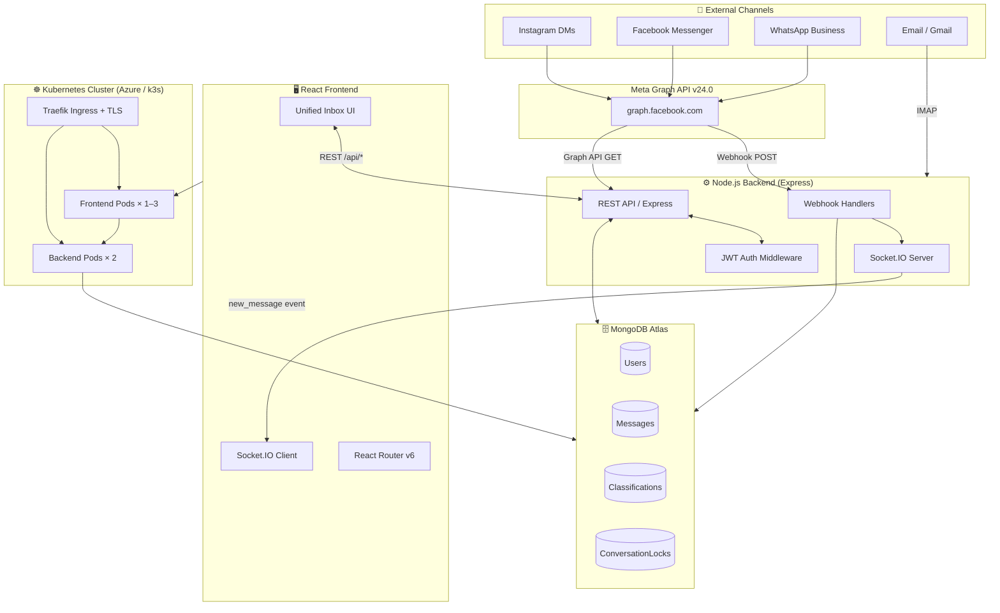
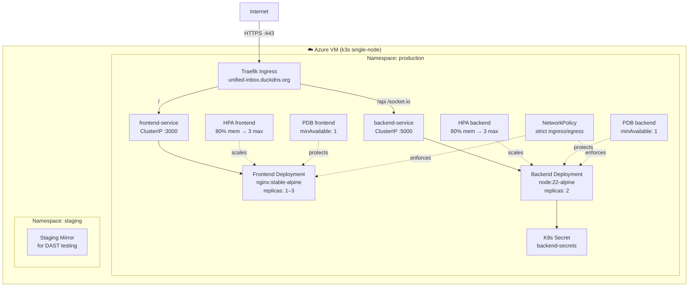
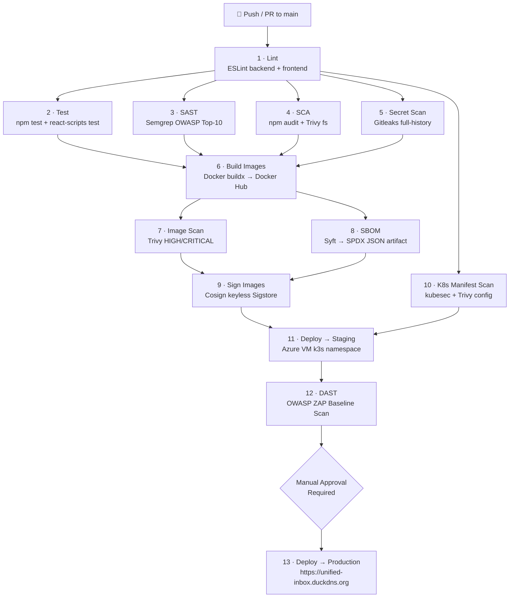
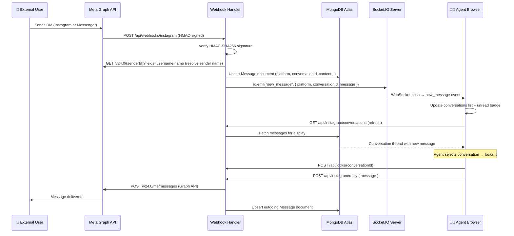
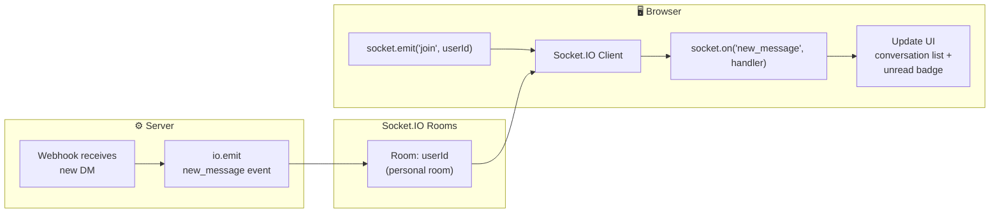

<div align="center">

# 📬 Unified Inbox

### Centralized Multi-Channel Customer Communication Platform

[](https://nodejs.org)
[](https://react.dev)
[](https://www.mongodb.com/atlas)
[](https://www.docker.com)
[](https://k3s.io)
[](https://github.com/features/actions)
[](https://socket.io)
[](LICENSE)

</div>

---

## 📋 Table of Contents

1. [Project Description](#1-project-description)
2. [Features](#2-features)
3. [System Architecture](#3-system-architecture)
4. [Tech Stack](#4-tech-stack)
5. [Project Structure](#5-project-structure)
6. [Installation](#6-installation)
7. [Environment Variables](#7-environment-variables)
8. [Running Locally](#8-running-locally)
9. [Running with Docker](#9-running-with-docker)
10. [Kubernetes Deployment](#10-kubernetes-deployment)
11. [CI/CD Pipeline](#11-cicd-pipeline)
12. [DevSecOps & Security](#12-devsecops--security)
13. [API Endpoints](#13-api-endpoints)
14. [Real-time Communication Flow](#14-real-time-communication-flow)
15. [UI Overview](#15-ui-overview)
16. [Workflow Explanation](#16-workflow-explanation)
17. [Troubleshooting](#17-troubleshooting)
18. [Future Improvements](#18-future-improvements)
19. [Contributors](#19-contributors)
20. [License](#20-license)

---

## 1. Project Description

**Unified Inbox** is a full-stack, production-grade customer communication platform that aggregates messages from multiple social and digital channels — **Instagram DMs**, **Facebook Messenger**, **WhatsApp Business**, and **Email** — into a single, real-time web interface.

Customer-facing teams (agents, managers, marketing) can:

- Read and reply to messages from all channels in one view
- Classify conversations by intent (`Cible`, `Hors Cible`, `Suivi`, `Priorité`)
- Lock conversations to prevent duplicate responses
- Receive instant push notifications when new messages arrive via **Socket.IO**
- Access role-specific dashboards (`Admin`, `Manager`, `Marketing`)

The platform is deployed on a **Kubernetes (k3s)** cluster hosted on **Azure**, secured by a full **DevSecOps pipeline** on **GitHub Actions**, and served over **HTTPS** via Traefik + Let's Encrypt.

> 💡 **Context**: This project was developed as a Final Year Engineering Project (PFE) and demonstrates end-to-end competency in full-stack development, cloud-native deployment, and DevSecOps practices.

---

## 2. Features

| Feature                        | Description                                                                                                            |
| ------------------------------ | ---------------------------------------------------------------------------------------------------------------------- |
| 🌐 Multi-channel Inbox         | Instagram DMs, Facebook Messenger, WhatsApp, Email                                                                     |
| ⚡ Real-time Updates           | Socket.IO push notifications for new messages                                                                          |
| 🔐 JWT Authentication          | Stateless auth with 7-day token expiry                                                                                 |
| 🎭 Role-Based Access Control   | Admin, Manager, Marketing — each with dedicated dashboards                                                             |
| 🏷️ Conversation Classification | Tag conversations: Cible, Hors Cible, Suivi, Priorité                                                                  |
| 🔒 Conversation Locking        | Prevent simultaneous agent replies to the same thread                                                                  |
| 📧 Email Integration           | IMAP polling + SMTP replies (Gmail-compatible)                                                                         |
| 📱 Webhook Ingestion           | Verified Meta platform webhooks (Instagram, Facebook)                                                                  |
| 🐳 Containerized               | Multi-stage hardened Docker images (non-root, Alpine)                                                                  |
| ☸️ Kubernetes-Native           | Deployments, HPA, PDB, NetworkPolicy, Ingress TLS                                                                      |
| 🔄 Full DevSecOps Pipeline     | 13-stage GitHub Actions: lint → test → SAST → SCA → secrets → build → image scan → SBOM → sign → staging → DAST → prod |
| 📊 Observability               | Grafana dashboard (Prometheus datasource) pre-configured                                                               |

---

## 3. System Architecture

### Global Architecture



---

### Kubernetes Deployment Topology



---

## 4. Tech Stack

### Backend

| Technology                   | Version   | Purpose                                 |
| ---------------------------- | --------- | --------------------------------------- |
| Node.js                      | 22 (LTS)  | JavaScript runtime                      |
| Express                      | 4.18      | HTTP framework                          |
| Socket.IO                    | 4.8       | Real-time bidirectional events          |
| Mongoose                     | 8.2       | MongoDB ODM                             |
| jsonwebtoken                 | 9.0       | JWT generation & verification           |
| bcryptjs                     | 2.4       | Password hashing (bcrypt)               |
| axios                        | 1.15      | HTTP client for Meta Graph API          |
| imap                         | 0.8       | IMAP email polling                      |
| mailparser                   | 3.9       | Email parsing (MIME, HTML, attachments) |
| nodemailer                   | 8.0       | SMTP email sending                      |
| passport + passport-facebook | 0.7 / 3.0 | OAuth strategy (Facebook)               |
| dotenv                       | 16        | Environment variable loading            |
| cors                         | 2.8       | Cross-Origin Resource Sharing           |

### Frontend

| Technology       | Version | Purpose             |
| ---------------- | ------- | ------------------- |
| React            | 18.2    | UI library          |
| React Router     | 6.22    | Client-side routing |
| Socket.IO Client | 4.8     | Real-time updates   |
| Axios            | 1.15    | HTTP client         |
| React Scripts    | 5.0     | CRA build tooling   |

### Infrastructure & DevOps

| Technology           | Purpose                                           |
| -------------------- | ------------------------------------------------- |
| MongoDB Atlas        | Managed cloud database                            |
| Docker               | Container images (multi-stage, hardened)          |
| Nginx                | Static file serving + reverse proxy in containers |
| Kubernetes (k3s)     | Container orchestration on Azure VM               |
| Traefik              | Ingress controller + TLS termination              |
| cert-manager         | Automated Let's Encrypt certificates              |
| GitHub Actions       | 13-stage DevSecOps CI/CD pipeline                 |
| Grafana + Prometheus | Observability & dashboards                        |
| Kyverno              | Kubernetes policy engine                          |

### Security Tools (DevSecOps)

| Tool           | Stage       | Purpose                                           |
| -------------- | ----------- | ------------------------------------------------- |
| ESLint         | Lint        | Static code style analysis                        |
| Semgrep        | SAST        | Source code vulnerability scanning (OWASP Top 10) |
| npm audit      | SCA         | Dependency vulnerability audit                    |
| Trivy (fs)     | SCA         | Filesystem dependency scan                        |
| Gitleaks       | Secret Scan | Hardcoded secrets / credentials detection         |
| Trivy (image)  | Image Scan  | Container image CVE scanning                      |
| Syft (SBOM)    | SBOM        | Software Bill of Materials generation             |
| Cosign         | Sign        | Keyless image signing (Sigstore)                  |
| kubesec        | K8s Scan    | Kubernetes manifest security scoring              |
| Trivy (config) | K8s Scan    | Kubernetes manifest misconfiguration scan         |
| OWASP ZAP      | DAST        | Dynamic Application Security Testing              |
| Kyverno        | Runtime     | Cluster admission policy enforcement              |

---

## 5. Project Structure

```
unified-inbox/
├── .github/
│   └── workflows/
│       └── devsecops.yml        # 13-stage GitHub Actions DevSecOps pipeline
├── client/                      # React frontend
│   ├── Dockerfile               # Multi-stage hardened nginx build
│   ├── nginx.conf               # Nginx config with Socket.IO proxy
│   ├── package.json
│   ├── public/
│   │   └── index.html
│   └── src/
│       ├── App.js               # Router setup + protected routes
│       ├── index.js
│       ├── index.css
│       ├── components/
│       │   ├── DashboardLayout.js
│       │   └── ProtectedRoute.js
│       ├── context/
│       │   ├── AuthContext.js   # JWT auth state (login/logout/token)
│       │   └── ThemeContext.js
│       └── pages/
│           ├── Login.js
│           ├── Inbox.js         # Main unified inbox (Socket.IO + all channels)
│           ├── AdminDashboard.js
│           ├── ManagerDashboard.js
│           ├── MarketingDashboard.js
│           ├── Signup.js
│           ├── TermsOfService.js
│           └── PrivacyPolicy.js
├── server/                      # Node.js/Express backend
│   ├── Dockerfile               # Multi-stage hardened node:22-alpine build
│   ├── index.js                 # App entrypoint + Socket.IO setup
│   ├── config/
│   │   └── db.js                # MongoDB Atlas connection
│   ├── middleware/
│   │   └── auth.js              # JWT protect + role authorize
│   ├── models/
│   │   ├── User.js              # Role-based user (admin/manager/marketing)
│   │   ├── Message.js           # Unified message model (all platforms)
│   │   ├── Classification.js    # Conversation intent classification
│   │   └── ConversationLock.js  # Agent conversation locking
│   └── routes/
│       ├── auth.js              # Login + admin user creation
│       ├── dashboard.js         # Role-gated dashboards
│       ├── webhooks.js          # Meta platform webhook ingestion
│       ├── instagram.js         # Instagram conversations + replies
│       ├── facebook.js          # Facebook Messenger conversations + replies
│       ├── email.js             # IMAP polling + SMTP replies
│       ├── classifications.js   # Conversation classification CRUD
│       ├── locks.js             # Conversation locking management
│       └── conversations.js     # Conversation deletion
├── k8s/                         # Kubernetes manifests
│   ├── backend-deployment.yaml  # Backend Deployment + ClusterIP Service
│   ├── frontend-deployment.yaml # Frontend Deployment + ClusterIP Service
│   ├── backend-secrets.yaml     # Secrets template (never commit real values)
│   ├── ingress-tls.yaml         # Production TLS ingress (DuckDNS + cert-manager)
│   ├── ingress-staging.yaml     # Staging ingress (HTTP)
│   ├── hpa.yaml                 # HorizontalPodAutoscaler (1–3 replicas)
│   ├── pdb.yaml                 # PodDisruptionBudget (minAvailable: 1)
│   ├── network-policy.yaml      # Strict NetworkPolicy (ingress/egress)
│   ├── kyverno-policies.yaml    # Admission control policies
│   └── grafana-dashboard.yaml   # Grafana dashboard ConfigMap
├── docker-compose.yml           # Local multi-container dev/test environment
├── package.json                 # Root package (owns all backend deps + scripts)
└── README.md
```

---

## 6. Installation

### Prerequisites

| Requirement             | Minimum Version      |
| ----------------------- | -------------------- |
| Node.js                 | 18+ (22 recommended) |
| npm                     | 9+                   |
| MongoDB Atlas           | Free tier or higher  |
| Docker & Docker Compose | Latest stable        |
| kubectl                 | 1.28+                |

### Clone the repository

```bash
git clone https://github.com/<your-org>/unified-inbox.git
cd unified-inbox
```

### Install dependencies

```bash
# Install backend dependencies (root package.json)
npm install

# Install frontend dependencies
cd client && npm install && cd ..
```

---

## 7. Environment Variables

Create a `.env` file in the **project root** (same level as `package.json`):

```bash
cp k8s/backend-secrets.yaml .env.example
# Edit .env with real values
```

### `.env.example`

```env
# ─── Server ───────────────────────────────────────────────────────────────────
PORT=5000
NODE_ENV=development

# ─── Database ─────────────────────────────────────────────────────────────────
MONGO_URI=mongodb+srv://<user>:<password>@cluster0.xxxxx.mongodb.net/unified-inbox?retryWrites=true&w=majority

# ─── Authentication ───────────────────────────────────────────────────────────
JWT_SECRET=your_very_long_random_secret_at_least_32_chars

# ─── WhatsApp Business (Meta Graph API) ───────────────────────────────────────
WHATSAPP_API_URL=https://graph.facebook.com/v24.0
WHATSAPP_PHONE_NUMBER_ID=REPLACE_ME
WHATSAPP_ACCESS_TOKEN=REPLACE_ME
WHATSAPP_VERIFY_TOKEN=REPLACE_ME

# ─── Facebook Messenger ───────────────────────────────────────────────────────
FACEBOOK_APP_ID=REPLACE_ME
FACEBOOK_APP_SECRET=REPLACE_ME
FACEBOOK_PAGE_ID=REPLACE_ME
FACEBOOK_PAGE_ACCESS_TOKEN=REPLACE_ME
FACEBOOK_VERIFY_TOKEN=your_custom_verify_token

# ─── Instagram DMs (uses Facebook Page credentials) ──────────────────────────
INSTAGRAM_ACCESS_TOKEN=REPLACE_ME
INSTAGRAM_ACCOUNT_ID=REPLACE_ME

# ─── Email (Gmail IMAP/SMTP) ──────────────────────────────────────────────────
EMAIL_USER=your@gmail.com
EMAIL_PASSWORD=your_app_password_not_gmail_password
EMAIL_IMAP_HOST=imap.gmail.com
EMAIL_IMAP_PORT=993
EMAIL_SMTP_HOST=smtp.gmail.com
EMAIL_SMTP_PORT=587
EMAIL_FROM_NAME=Unified Inbox
```

### Environment Variables Reference Table

| Variable                     | Required           | Description                                        |
| ---------------------------- | ------------------ | -------------------------------------------------- |
| `PORT`                       | No (default: 5000) | Express server port                                |
| `MONGO_URI`                  | ✅                 | MongoDB Atlas connection string                    |
| `JWT_SECRET`                 | ✅                 | Secret for signing JWT tokens (32+ chars)          |
| `FACEBOOK_APP_SECRET`        | ✅                 | Used to verify webhook signatures (HMAC-SHA256)    |
| `FACEBOOK_PAGE_ID`           | ✅                 | Your Facebook Page ID                              |
| `FACEBOOK_PAGE_ACCESS_TOKEN` | ✅                 | Page-level access token (never-expiring preferred) |
| `FACEBOOK_VERIFY_TOKEN`      | ✅                 | Custom string for Meta webhook verification        |
| `INSTAGRAM_ACCESS_TOKEN`     | ✅                 | Instagram Graph API token                          |
| `INSTAGRAM_ACCOUNT_ID`       | ✅                 | Instagram Business Account ID                      |
| `WHATSAPP_PHONE_NUMBER_ID`   | ✅                 | WhatsApp Business phone number ID                  |
| `WHATSAPP_ACCESS_TOKEN`      | ✅                 | WhatsApp Business API token                        |
| `WHATSAPP_VERIFY_TOKEN`      | ✅                 | Custom string for WhatsApp webhook verification    |
| `EMAIL_USER`                 | For email          | Gmail address used for IMAP/SMTP                   |
| `EMAIL_PASSWORD`             | For email          | Gmail App Password (not your regular password)     |
| `EMAIL_IMAP_HOST`            | For email          | IMAP server (default: `imap.gmail.com`)            |
| `EMAIL_SMTP_HOST`            | For email          | SMTP server (default: `smtp.gmail.com`)            |

> ⚠️ **Security**: Never commit your `.env` file. It is already in `.gitignore`. In production, all secrets are injected via Kubernetes Secrets.

---

## 8. Running Locally

### Option A — Full Stack (recommended)

```bash
npm run dev
```

This runs `nodemon server/index.js` (backend on `:5000`) and `react-scripts start` (frontend on `:3000`) **concurrently** via the `concurrently` package.

The React dev server proxies all `/api/*` calls to `http://localhost:5000` (configured in `client/package.json`).

### Option B — Backend Only

```bash
npm run server:dev     # with nodemon (auto-reload)
# or
npm run server         # plain node
```

### Option C — Frontend Only

```bash
npm run client
# or
cd client && npm start
```

### Option D — Build Frontend for Production

```bash
npm run build
# Outputs to client/build/
```

---

## 9. Running with Docker

### Build and run with Docker Compose

```bash
# Create the external network first (one-time setup)
docker network create network1

# Build and start both services
docker compose up --build

# Detached mode
docker compose up -d --build
```

| Service    | Port        | Description               |
| ---------- | ----------- | ------------------------- |
| `backend`  | `5000:5000` | Express API + Socket.IO   |
| `frontend` | `3000:80`   | React app served by Nginx |

### Build individual images

```bash
# Backend
docker build -f server/Dockerfile -t unified-inbox-backend:latest .

# Frontend
docker build -f client/Dockerfile -t unified-inbox-frontend:latest ./client
```

### Container Security Features

Both Dockerfiles use a **hardened multi-stage build** pattern:

- **Base image**: `node:22-alpine` / `nginx:stable-alpine` (minimal attack surface)
- **Non-root user**: `appuser (UID 1001)` / `nginx` — never runs as root
- **Dependencies only**: `npm ci --omit=dev` strips devDependencies in production
- **Health checks**: `HEALTHCHECK` instruction in both images
- **Read-only where possible**: Restricted filesystem capabilities

```dockerfile
# Example — backend non-root setup
RUN addgroup -g 1001 appgroup && adduser -u 1001 -G appgroup -s /bin/sh -D appuser
USER appuser
```

---

## 10. Kubernetes Deployment

### Prerequisites

- Azure VM running **k3s** (single-node cluster)
- `kubectl` configured with your cluster credentials
- `cert-manager` installed (for Let's Encrypt TLS)
- Kyverno installed (for policy enforcement)

### Apply all manifests

```bash
# 1. Create secrets (fill in real values first)
cp k8s/backend-secrets.yaml k8s/backend-secrets.local.yaml
# Edit k8s/backend-secrets.local.yaml with real values
kubectl apply -f k8s/backend-secrets.local.yaml -n production

# 2. Apply network policies
kubectl apply -f k8s/network-policy.yaml -n production

# 3. Deploy backend and frontend
kubectl apply -f k8s/backend-deployment.yaml -n production
kubectl apply -f k8s/frontend-deployment.yaml -n production

# 4. Apply ingress (TLS + domain)
kubectl apply -f k8s/ingress-tls.yaml -n production

# 5. Apply availability / scaling
kubectl apply -f k8s/pdb.yaml -n production
kubectl apply -f k8s/hpa.yaml -n production

# 6. Apply Kyverno admission policies
kubectl apply -f k8s/kyverno-policies.yaml

# 7. Apply Grafana dashboard
kubectl apply -f k8s/grafana-dashboard.yaml -n monitoring
```

### Verify deployment

```bash
kubectl get pods -n production
kubectl get svc -n production
kubectl get ingress -n production
kubectl get hpa -n production
```

### Kubernetes Resource Summary

| Resource      | Name                            | Description                                       |
| ------------- | ------------------------------- | ------------------------------------------------- |
| Deployment    | `backend`                       | 2 replicas, rolling update, non-root              |
| Deployment    | `frontend`                      | 1 replica min, Nginx-served React                 |
| Service       | `backend-service`               | ClusterIP `:5000`                                 |
| Service       | `frontend-service`              | ClusterIP `:3000`                                 |
| Ingress       | `unified-inbox-ingress`         | Traefik, TLS, domain: `unified-inbox.duckdns.org` |
| HPA           | `backend-hpa`                   | 1–3 replicas, 80% memory threshold                |
| HPA           | `frontend-hpa`                  | 1–3 replicas, 80% memory threshold                |
| PDB           | `backend-pdb`                   | `minAvailable: 1`                                 |
| PDB           | `frontend-pdb`                  | `minAvailable: 1`                                 |
| NetworkPolicy | `backend-netpol`                | Allow only from frontend + Traefik                |
| NetworkPolicy | `frontend-netpol`               | Allow only from Traefik ingress                   |
| Secret        | `backend-secrets`               | All runtime secrets (injected at pod start)       |
| ClusterPolicy | `disallow-root-user`            | Kyverno: block root containers (Enforce)          |
| ClusterPolicy | `disallow-privilege-escalation` | Kyverno: block privilege escalation (Enforce)     |
| ClusterPolicy | `require-resource-limits`       | Kyverno: require CPU+memory limits (Enforce)      |

---

## 11. CI/CD Pipeline

The pipeline is defined in [.github/workflows/devsecops.yml](.github/workflows/devsecops.yml) and runs on every push or PR to `main`.

### Pipeline Flow



### Stage-by-Stage Explanation

| #   | Stage                 | Tool                               | Triggered By                     | Gate                   |
| --- | --------------------- | ---------------------------------- | -------------------------------- | ---------------------- |
| 1   | **Lint**              | ESLint                             | push/PR                          | Always runs first      |
| 2   | **Test**              | npm test, react-scripts            | After lint                       | Blocks build           |
| 3   | **SAST**              | Semgrep (JS/Node/React/OWASP)      | After lint                       | Blocks build           |
| 4   | **SCA**               | npm audit + Trivy fs               | After lint                       | Blocks build           |
| 5   | **Secret Scan**       | Gitleaks (full Git history)        | After lint                       | Blocks build           |
| 6   | **Build**             | Docker buildx + push to Docker Hub | After 2,3,4,5                    | Produces tagged images |
| 7   | **Image Scan**        | Trivy (HIGH/CRITICAL CVEs)         | After build                      | Blocks signing         |
| 8   | **SBOM**              | Syft → SPDX JSON                   | After build                      | Produces artifact      |
| 9   | **Sign**              | Cosign keyless (Sigstore)          | After 7+8                        | Blocks staging         |
| 10  | **K8s Manifest Scan** | kubesec + Trivy config             | After lint                       | Blocks staging         |
| 11  | **Deploy Staging**    | SSH + kubectl (staging ns)         | After 9+10, `main` only          | Enables DAST           |
| 12  | **DAST**              | OWASP ZAP baseline                 | After staging                    | Blocks production      |
| 13  | **Deploy Production** | SSH + kubectl (production ns)      | After DAST + **manual approval** | Live at domain         |

> 🔐 Production deployment requires **manual approval** via GitHub Environments. No code reaches production without a human gate.

---

## 12. DevSecOps & Security

### Security Architecture Overview

```mermaid
flowchart LR
    subgraph CODE["📝 Code Security"]
        SG[Semgrep SAST\nOWASP Top-10 rules]
        GL[Gitleaks\nSecret detection]
        NA[npm audit\nDependency CVEs]
    end

    subgraph IMAGE["🐳 Image Security"]
        TF[Trivy fs scan\nFilesystem CVEs]
        TI[Trivy image scan\nContainer CVEs]
        SY[Syft SBOM\nSPDX inventory]
        CS[Cosign sign\nKeyless Sigstore]
    end

    subgraph K8S["☸️ Runtime Security"]
        KS[kubesec\nManifest scoring]
        KV[Kyverno policies\nAdmission control]
        NP[NetworkPolicy\nEast-west traffic]
        SEC[SecurityContext\nnon-root + drop ALL caps]
    end

    subgraph DAST["🌐 Application Security"]
        ZAP[OWASP ZAP\nDynamic scanning]
        JWT[JWT + bcrypt\nAuth hardening]
        CORS[CORS policy\nOrigin restriction]
    end

    CODE --> IMAGE --> K8S --> DAST
```



### Implemented Security Controls

#### Application Layer

| Control                        | Implementation                                                   |
| ------------------------------ | ---------------------------------------------------------------- |
| Password hashing               | `bcryptjs` with salt rounds = 10                                 |
| JWT tokens                     | RS256-equivalent, 7-day expiry, secret stored in K8s Secret      |
| Authorization                  | Role-based middleware on every protected route                   |
| Webhook signature verification | HMAC-SHA256 via `FACEBOOK_APP_SECRET`                            |
| No secrets in code             | All credentials injected via environment variables / K8s Secrets |

#### Container & Kubernetes Layer

| Control                 | Implementation                                                            |
| ----------------------- | ------------------------------------------------------------------------- |
| Non-root containers     | `runAsNonRoot: true`, `runAsUser: 1000` in both Dockerfiles and K8s specs |
| Minimal base images     | `node:22-alpine`, `nginx:stable-alpine`                                   |
| Dropped capabilities    | `capabilities.drop: [ALL]` in securityContext                             |
| No privilege escalation | `allowPrivilegeEscalation: false` (enforced by Kyverno)                   |
| Network segmentation    | `NetworkPolicy` restricts pod-to-pod traffic                              |
| Secrets management      | `kubectl Secret` with `secretRef` — never in env vars in manifests        |
| Immutable images        | `imagePullPolicy: Always` ensures latest signed image                     |
| Resource limits         | CPU and memory limits on all containers (enforced by Kyverno)             |
| Health probes           | Liveness + readiness probes (enforced by Kyverno)                         |
| TLS everywhere          | cert-manager + Let's Encrypt via Traefik                                  |

#### OWASP Top 10 Coverage

| OWASP Risk                    | Mitigation                                                     |
| ----------------------------- | -------------------------------------------------------------- |
| A01 Broken Access Control     | RBAC middleware, role checks on every endpoint                 |
| A02 Cryptographic Failures    | bcrypt hashing, HTTPS enforced, JWT secrets via K8s Secrets    |
| A03 Injection                 | Mongoose ODM parameterized queries, input validation           |
| A05 Security Misconfiguration | Kyverno policies, Trivy config scan, kubesec                   |
| A06 Vulnerable Components     | npm audit + Trivy SCA on every pipeline run                    |
| A07 Auth Failures             | JWT expiry, strong secret requirement checked at startup       |
| A09 Logging Failures          | Webhook debug endpoint (protected), structured console logging |

---

## 13. API Endpoints

### Authentication

| Method | Endpoint                | Auth       | Description                       |
| ------ | ----------------------- | ---------- | --------------------------------- |
| `POST` | `/api/auth/login`       | None       | Login with email + password → JWT |
| `POST` | `/api/auth/create-user` | Admin only | Create a new user account         |
| `GET`  | `/api/auth/me`          | Bearer JWT | Get current authenticated user    |

#### Login Request / Response

```http
POST /api/auth/login
Content-Type: application/json

{
  "email": "admin@example.com",
  "password": "yourpassword"
}
```

```json
{
  "_id": "663f...",
  "firstName": "Adem",
  "lastName": "Example",
  "email": "admin@example.com",
  "role": "admin",
  "token": "eyJhbGciOiJIUzI1NiIsInR5cCI6IkpXVCJ9..."
}
```

---

### Dashboards

| Method | Endpoint                   | Auth      | Description              |
| ------ | -------------------------- | --------- | ------------------------ |
| `GET`  | `/api/dashboard/admin`     | Admin     | Admin dashboard data     |
| `GET`  | `/api/dashboard/manager`   | Manager   | Manager dashboard data   |
| `GET`  | `/api/dashboard/marketing` | Marketing | Marketing dashboard data |

---

### Messaging

| Method | Endpoint                       | Auth       | Description                            |
| ------ | ------------------------------ | ---------- | -------------------------------------- |
| `GET`  | `/api/instagram/conversations` | Bearer JWT | Fetch all Instagram DM conversations   |
| `POST` | `/api/instagram/reply`         | Bearer JWT | Send reply to Instagram DM             |
| `GET`  | `/api/facebook/conversations`  | Bearer JWT | Fetch Facebook Messenger conversations |
| `POST` | `/api/facebook/reply`          | Bearer JWT | Send reply via Messenger               |
| `GET`  | `/api/email/messages`          | Bearer JWT | Fetch latest 50 emails via IMAP        |
| `POST` | `/api/email/send`              | Bearer JWT | Send email via SMTP                    |

---

### Webhooks (Meta Platform — public, verified)

| Method | Endpoint                  | Auth           | Description                         |
| ------ | ------------------------- | -------------- | ----------------------------------- |
| `GET`  | `/api/webhooks/instagram` | Verify token   | Meta webhook verification challenge |
| `POST` | `/api/webhooks/instagram` | HMAC signature | Receive Instagram DM webhook        |
| `GET`  | `/api/webhooks/facebook`  | Verify token   | Meta webhook verification challenge |
| `POST` | `/api/webhooks/facebook`  | HMAC signature | Receive Facebook Messenger webhook  |
| `GET`  | `/api/webhooks/debug`     | Admin Bearer   | Webhook health + recent message log |

---

### Classifications

| Method | Endpoint                                  | Auth       | Description                            |
| ------ | ----------------------------------------- | ---------- | -------------------------------------- |
| `GET`  | `/api/classifications?platform=instagram` | Bearer JWT | Get all classifications for a platform |
| `PUT`  | `/api/classifications`                    | Bearer JWT | Set/update conversation classification |

**Valid classifications**: `cible`, `hors_cible`, `non_classifie`, `suivi`, `priorite`

---

### Conversation Locks

| Method   | Endpoint                        | Auth       | Description                        |
| -------- | ------------------------------- | ---------- | ---------------------------------- |
| `GET`    | `/api/locks?platform=instagram` | Bearer JWT | Get all locks for a platform       |
| `GET`    | `/api/locks/all`                | Admin      | Get all locks across all platforms |
| `POST`   | `/api/locks/:conversationId`    | Bearer JWT | Lock a conversation (claim it)     |
| `DELETE` | `/api/locks/:conversationId`    | Admin      | Force-unlock a conversation        |

---

### Conversations

| Method   | Endpoint             | Auth            | Description                            |
| -------- | -------------------- | --------------- | -------------------------------------- |
| `DELETE` | `/api/conversations` | Admin / Manager | Delete a conversation and all its data |

---

## 14. Real-time Communication Flow

### Message Journey: Facebook/Instagram → Unified Inbox



### Socket.IO Event Architecture



The inbox maintains a **persistent Socket.IO connection** for the lifetime of the user session. On login, the client calls `socket.emit("join", userId)` to subscribe to a personal room. When a webhook fires, the server emits to that room — the client instantly updates the conversation list and increments the unread badge for the relevant platform tab.

---

## 15. UI Overview

> 📌 Screenshots are not included in this README. Below is a structural description of each view.

### Login Page (`/login`)

- Email + password form
- JWT stored in `localStorage` on success
- Redirects to role-based dashboard on success

### Role-based Dashboards

| Route        | Role      | Features                                                                                        |
| ------------ | --------- | ----------------------------------------------------------------------------------------------- |
| `/admin`     | Admin     | Create users (admin/manager/marketing), view all conversation locks, force-unlock conversations |
| `/manager`   | Manager   | Team performance overview, assign conversations, response time monitoring                       |
| `/marketing` | Marketing | Campaign management, broadcast messages, audience segmentation                                  |

### Unified Inbox (`/inbox`)

- **Platform tabs**: Instagram · Facebook · WhatsApp · Email with unread count badges
- **Conversation list** (left panel): sorted by last message, classified with color-coded labels
- **Message thread** (center panel): full message history, inline attachments, HTML email rendering
- **Reply box** (bottom): text input + send button
- **Classification selector**: dropdown to tag conversation intent
- **Lock indicator**: shows which agent has locked a conversation
- **Real-time status badge**: "Connected" / "Disconnected" Socket.IO indicator
- **Classification filter**: filter conversation list by category

---

## 16. Workflow Explanation

### New Agent Onboarding

1. An **Admin** logs into `/admin`
2. Admin fills the "Create Account" form with first/last name, email, password, and role
3. Backend `POST /api/auth/create-user` hashes the password (bcrypt, 10 rounds) and persists to MongoDB
4. New agent receives credentials and can log in immediately at `/login`

### Handling an Incoming Instagram DM

1. A customer sends a DM to the connected Instagram Business account
2. Meta's servers call `POST /api/webhooks/instagram` with a JSON payload
3. The server verifies the **HMAC-SHA256 signature** using `FACEBOOK_APP_SECRET`
4. The sender's username is resolved via the Graph API and stored on the message
5. The message is **upserted** into MongoDB (deduplication via `externalId`)
6. `io.emit("new_message", ...)` fires → all connected agents receive the Socket.IO event
7. An agent opens the Inbox, clicks the Instagram tab (which has a red unread badge)
8. The agent **locks** the conversation (`POST /api/locks/{conversationId}`)
9. The agent reads the full thread, types a reply, clicks Send
10. Backend calls `POST /v24.0/me/messages` on the Graph API → message delivered to customer
11. The outgoing message is stored in MongoDB with `direction: "outgoing"`
12. The agent classifies the conversation as `cible` (targeted lead)

### Conversation Classification

Each conversation can be tagged:

| Tag             | French Label  | Color | Meaning                  |
| --------------- | ------------- | ----- | ------------------------ |
| `non_classifie` | Non Classifié | Gray  | Default, unreviewed      |
| `cible`         | Cible         | Green | High-value / target lead |
| `hors_cible`    | Hors Cible    | Red   | Not a relevant prospect  |
| `suivi`         | Suivi         | Blue  | Being followed up        |
| `priorite`      | Priorité      | Amber | Urgent / high priority   |

---

## 17. Troubleshooting

### Backend won't start

```bash
# Check that .env exists at project root and MONGO_URI is set
cat .env | grep MONGO_URI

# Verify MongoDB connectivity
node -e "require('dotenv').config(); const m = require('mongoose'); m.connect(process.env.MONGO_URI).then(() => console.log('OK')).catch(console.error)"
```

### `JWT_SECRET is missing` error on every request

Ensure your `.env` file is at the **project root** (not inside `server/`). The backend loads it via:

```js
dotenv.config({ path: path.resolve(__dirname, "../.env") });
```

### Socket.IO shows "Disconnected" in the inbox

- In development, ensure the backend is running on `:5000`
- The React client proxies to `http://localhost:5000` (via `client/package.json` `"proxy"` field)
- In production, Socket.IO connects to `window.location.origin` — the Traefik Ingress must have the `/socket.io/` path rule and WebSocket upgrade headers configured (already in `ingress-tls.yaml`)

### Webhooks not receiving messages

1. The webhook endpoint must be publicly accessible (use [ngrok](https://ngrok.com/) for local testing)
2. Verify the `FACEBOOK_VERIFY_TOKEN` in `.env` matches what you registered in the Meta App dashboard
3. Check signature verification: `FACEBOOK_APP_SECRET` must match your Meta App's App Secret
4. Use the debug endpoint: `GET /api/webhooks/debug` (requires admin JWT)

### Docker Compose fails with `network not found`

```bash
docker network create network1
docker compose up --build
```

### Kubernetes pods in `CrashLoopBackOff`

```bash
kubectl logs deployment/backend -n production
# Most common cause: backend-secrets not applied or MONGO_URI is wrong
kubectl describe secret backend-secrets -n production
```

### Images not updating after a push

```bash
# Force pods to pull the latest image
kubectl rollout restart deployment/backend -n production
kubectl rollout restart deployment/frontend -n production
kubectl rollout status deployment/backend -n production
```

---

## 18. Future Improvements

| Feature                       | Priority | Description                                                              |
| ----------------------------- | -------- | ------------------------------------------------------------------------ |
| 🤖 AI Response Suggestions    | High     | Integrate OpenAI/Gemini to suggest replies based on conversation context |
| 📊 Analytics Dashboard        | High     | Message volume charts, response time metrics, classification breakdowns  |
| 💬 WhatsApp Webhook           | High     | Complete real-time WhatsApp webhook ingestion (currently polling-based)  |
| 🎵 TikTok Integration         | Medium   | TikTok DMs API (model already scaffolded)                                |
| 📋 Ticket System              | Medium   | Convert conversations into tracked support tickets                       |
| 👥 Multi-Agent Assignment     | Medium   | Assign conversations to specific agents from the manager dashboard       |
| 🔔 Browser Push Notifications | Medium   | Web Push API for off-tab alerts                                          |
| 🔑 OAuth Login                | Low      | Google / Microsoft SSO alongside email/password                          |
| 📝 Audit Log                  | Low      | Full audit trail of agent actions (replies, locks, classifications)      |
| 🌍 Internationalization       | Low      | Multi-language support (Arabic, French, English)                         |
| 🧪 E2E Test Coverage          | Medium   | Playwright or Cypress end-to-end tests                                   |
| 🗄️ Redis PubSub               | Medium   | Replace in-process Socket.IO with Redis adapter for multi-node HA        |

---

## 19. Contributors

| Name     | Role                                                |
| -------- | --------------------------------------------------- |
| **Adem** | Full-stack Developer, DevOps Engineer, Project Lead |

> This project was developed as a Final Year Project (Projet de Fin d'Études) for an Engineering degree. All architecture, implementation, and DevSecOps pipeline were designed and built from scratch.

---

## 20. License

This project is licensed under the **ISC License** — see the [LICENSE](LICENSE) file for details.

```
ISC License

Copyright (c) 2025-2026 Adem

Permission to use, copy, modify, and/or distribute this software for any
purpose with or without fee is hereby granted, provided that the above
copyright notice and this permission notice appear in all copies.
```

---

<div align="center">

**Built with ❤️ — Unified Inbox | PFE 2025–2026**

[](https://nodejs.org)
[](https://react.dev)
[](https://mongodb.com/atlas)
[](https://docker.com)
[](https://k3s.io)
[](https://github.com/features/actions)

</div>
